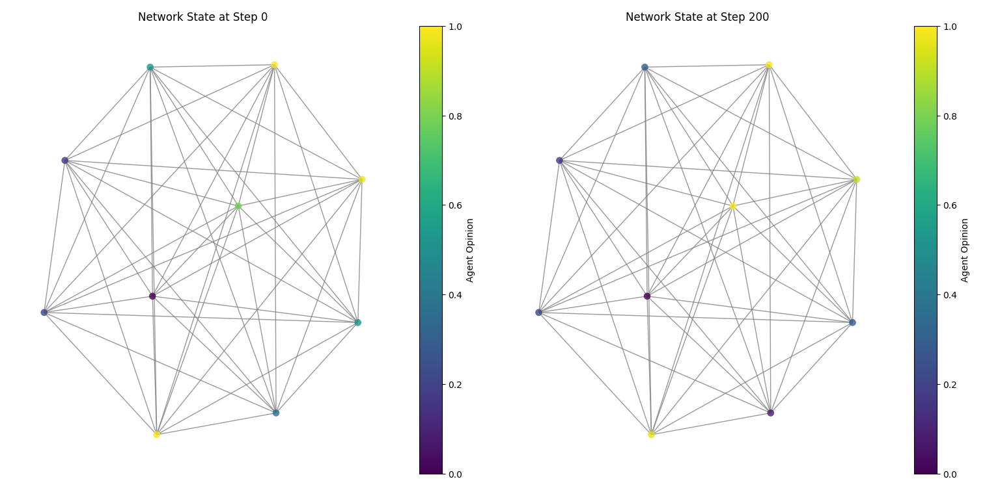

# Opinion Dynamics — assignment_01

This repository contains a simple agent-based opinion dynamics model implemented using Mesa's discrete-space utilities and Network support. The main script for this assignment is `assignment_01/assignment_01.py`.

## Problem description

We model how continuous opinions (values in [0, 1]) evolve among a population of agents connected by a network. Each agent holds an opinion and periodically interacts with its neighbors. During an interaction, an agent may adjust its opinion toward the neighbors' average when the difference is large enough. The goal is to observe whether opinions converge, cluster, or stay diverse depending on network topology and interaction rules.


## how network evolve with simualtion 


## Key parameters

- `num_agents`: number of agents (nodes in the network).
- `avg_node_degree`: used to compute the Erdős–Rényi connection probability p = avg_node_degree / num_agents.


## How to run

Requirements (at minimum): Python 3.8+, plus the following packages: mesa, numpy, networkx, matplotlib, pandas, seaborn.

Install dependencies (Windows `cmd.exe`):

```bat
python -m pip install mesa numpy networkx matplotlib pandas seaborn
```

Run the script:

```bat
python assignment_01/assignment_01.py
```

This will:
- Create a small random network (default in the script: 10 agents used for quick demo).
- Run the model for 200 steps (as in the script), then show two plots: initial and later network states colored by agent opinion, and print the collected dataframes for the mean opinion and agent opinions.


## Assumptions and edge cases

- The model assumes synchronous-ish behavior implemented via random-order activation (each step, every agent calls `exchange` once).
- If an agent has no neighbors, `exchange()` currently returns early and the opinion remains unchanged.
- Opinions are clipped to [0, 1] after each update to avoid drift outside the allowed range.

